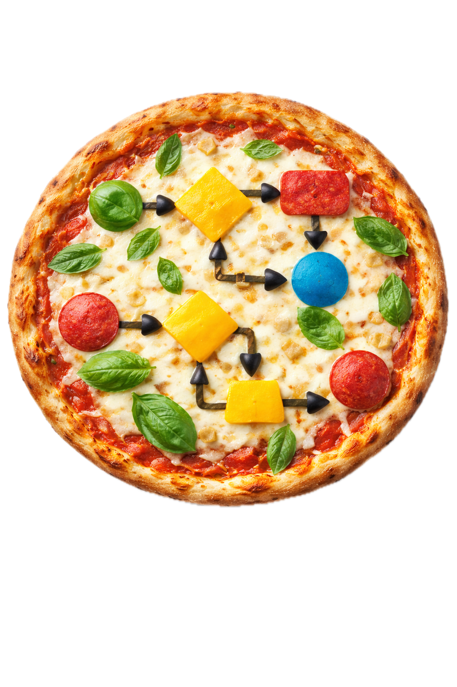

# Let's make pizza with BPMN

For a long time, I was looking for a good pizza recipe. I started before the internet era, asking friends how to make this tasty food. Finally, after years, I opened an Italian cookbook and voila - I was able to make my first good pizza bread. Of course, the secrets are hidden in small details that are easy to overlook. After many years, I have the impression that I know those secrets, and I am happy to share one more discovered in my professional work: the importance of business process documentation with well-known standards.

## Introduction to BPMN

BPMN (Business Process Model and Notation) is a well-established standard for visually describing how a process works from start to finish. You can read it like a map: who does what, in what order, and what decisions change the path. BPMN helps you:

- understand the process without reading long technical text,
- see hand-offs between people or systems,
- spot branching points and timing behavior,
- discuss improvements with a shared vocabulary.

There is nothing better than an example, so let's take a look at a pizza bread-making process.

## How to read the pizza process

Start with these six elements:

- **Pools** separate organization units with own processes (here: `On the road`, `Home`); communicates with others always using events.
- **Events (circles):** mark when something starts, waits, or ends.
- **Lanes:** separate responsibilities (for example `Hungry guys`, `Kitchen owner`, `Chef`).
- **Tasks (rounded rectangles):** show concrete actions, for example preparing pizza bread.
- **Gateways (diamonds):** split or join paths, such as choices (XOR). parallel work (AND), or one ore more possibilities (OR) 
- **Sequence flows (arrows):** show the order of execution.

This is enough to understand most of the model quickly, even before learning advanced BPMN features. For formal BPMN 2.0 element definitions and coverage, use the [CIB seven BPMN 2.0 Implementation Reference](https://docs.cibseven.org/manual/2.0/reference/bpmn20/).

Enjoy making pizza with BPMN!
